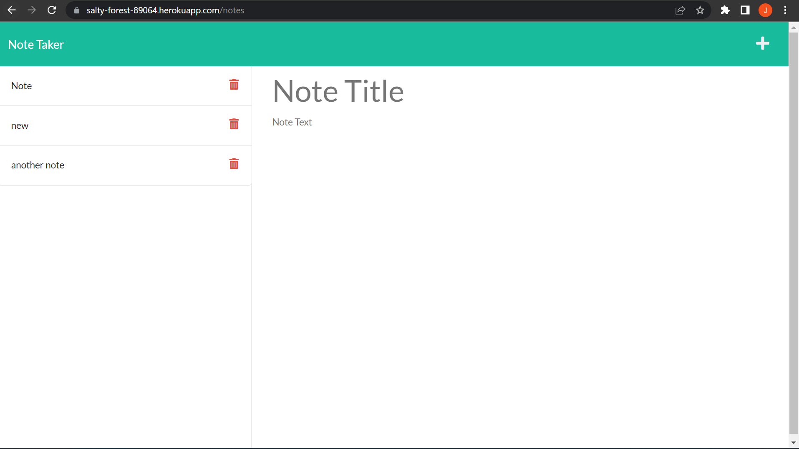

# Note Taker

  In this app, the user can write and save notes. The user can then view the saved notes by clicking on the desired note from the list on left hand side of screen.

  ## Table of Contents

  1. [Installation](#installation)
  2. [Usage](#usage)
  3. [Contributing](#contributing)
  4. [Tests](#tests)
  5. [Liscense](#liscense)
  6. [Author](#author)
  
  ## Installation
  
  no installation necessary
  
  ## Usage
  
  open the app by visiting https://salty-forest-89064.herokuapp.com in your web browser, and click the "get started" button. type a note title and body in the text boxes on right side of screen, and click the save (floppy disk) button. once note is saved, choose note from list to view.
  
  ## Contributing
  
  n/a

  ## Tests
  
  n/a
  
  ## License
  
  n/a

  ## Author
  Jared Ingersoll-student
  email: jaredingersoll14@gmail.com
  github: https://github.com/JaredIng87

  deployed URL: https://salty-forest-89064.herokuapp.com/notes

  